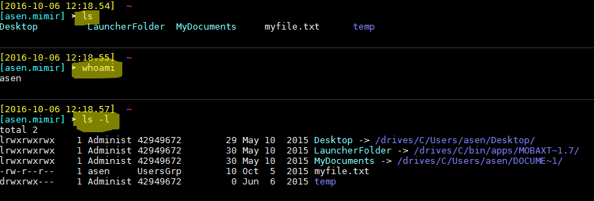

Разгледахме следните неща

### Как учат хората
Материалите са развити от Марин [тук](noviceToExpert.md)

### Какво е прогама и как се изпълнява
Материалите са развити от Ани [тук](whatIsAProgram.md)

### Какво е алгоритъм. Няколко примера
Материалите са развити от Борис [тук](whatIsAnAlgorithm.md)

### Какво е структура от данни. Няколко примера
Материалите са развити от Мартин [тук](https://github.com/martiniliev2016/domashno.git)

-----
### Как се пише в markdown формат
 - Отворете някой MarkDown файл за редактиране (например този) и сравнете текста с това което се показва в preview. Така става най-ясно.
 - Заглавните редове започват с един или повече диези - `###`
 - Параграфите се отделят с поне 2 реда
 - Списъци се правят или с тирета отместени навътре или с числа отместени навътре
 - Линкове се правят така `[link text](link url)`. Например `[как да научим Markdown](http://bfy.tw/83UP)` ще се покаже така - [как да научим Markdown](http://bfy.tw/83UP).
 - Картинки се добавят така ``. Например `` ще покаже

 

 - Може да се добавят и картинки от интернет. Например `` ще покаже 

 
